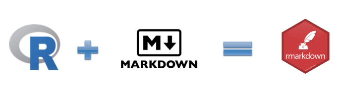
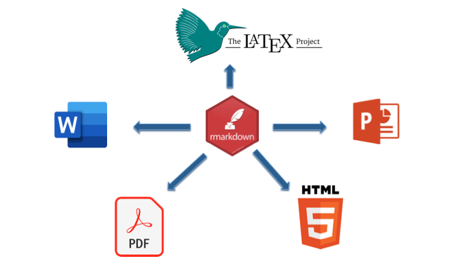
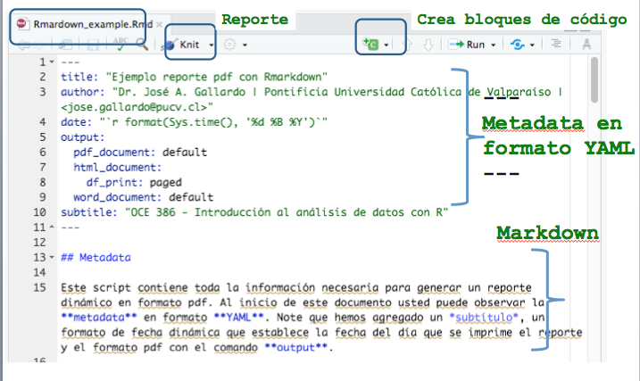
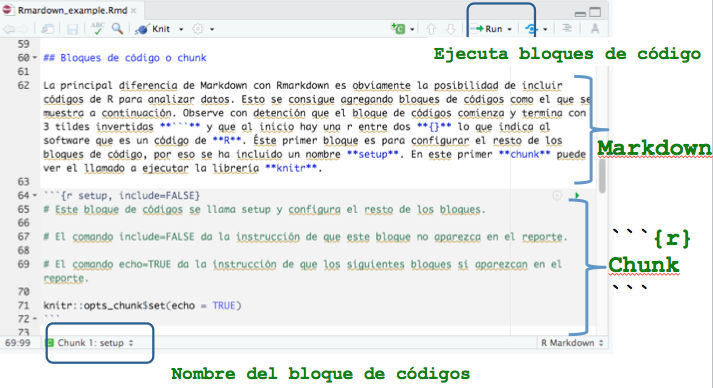

```{r setup, include=FALSE, comment=TRUE}
knitr::opts_chunk$set(echo = FALSE)
```

## 
<div class="centered">
<div class="black">
**PLAN DE CLASE**
</div>
</div>

<div class="black">
**1).** **Introducción**
</div>

- **Comunicar de forma efectiva**

- **¿Qué es Rmarkdown y para que sirve?**

- **¿Cómo funciona?**

<div class="black">
**2).** **Práctica con R y Rstudio (cloud)**
</div>

- **Escribir un código de programación con Rmarkdown**

- **Elaborar diferentes reportes dinámicos.**

## 
<div class="centered">
<div class="black">

**COMUNICAR RESULTADOS DE FORMA EFECTIVA**

</div>
</div>

<div class="black">
**1).** **80 % de la información que procesamos es visual**  
Por lo tanto, comunica tus resultados visualmente.  

**2).** **Nuestro cerebro evolucionó para buscar patrones**  
Por lo tanto, busca y muestra los patrónes que hayan en tus datos.  

**3).** **Memoria de corto plazo**  
Regla del $7 \pm 2$  
Nunca intentes comunicar mucha información simultáneamente.

</div>


## 
<div class="centered">
<div class="black">

**EXISTEN DISTINTAS FORMAS DE CREAR REPORTES**

</div>
</div>

<div class="black">

- **What You See Is What You Get**
Microsoft Word, Microsoft Power Point,formato de documento portátil (pdf)

- **What You See Is What You Mean**.
Latex, Markdown, HTML, Rmarkdown


```{r, echo=FALSE, out.width = '100%' }

```

</div>

## 
<div class="centered">
<div class="black">

**¿QUÉ ES R MARKDOWN?**

</div>
</div>

<div class="black">

Rmarkdown es un procesador de texto que permite la creación de reportes de alta calidad. 

```{r, echo=FALSE, out.width = '100%' }

```

</div>

## 
<div class="centered">
<div class="black">

**VENTAJAS DE USAR RMARKDOWN?**

</div>
</div>

<div class="black">


- Es un software libre y de código abierto, por lo que podemos usarlo sin necesidad de comprar una licencia.

- Permite trabajar bajo el paradigma de la investigación reproducible (texto sin formato).

- Cualquiera puede crear reportes, documentos, presentaciones y libros de alta calidad, con poco esfuerzo.

- Uno de los mejores sistemas para crear reportes colaborativos y mejorar el rendimiento del trabajo de los analistas de datos. 

</div>


## 
<div class="centered">
<div class="black">

## 

**¿CÓMO FUNCIONA R MARKDOWN?**

</div>
</div>

<div class="centered">
<div class="black">

</div>
</div>
<div class="columns-1">
```{r, echo=FALSE, out.width = '100%' }

```
</div>

## 

**¿CÓMO FUNCIONA R MARKDOWN?**

</div>
</div>

<div class="centered">
<div class="black">

</div>
</div>
<div class="columns-1">
```{r, echo=FALSE, out.width = '100%' }

```
</div>


## 

<div class="centered">
<div class="black">

**PRÁCTICA CON RMARKDOWN**

</div>
</div>

<div class="black">
**1).** **Guía de trabajo programación con Rmarkdown disponible en drive.** Ingresa al siguiente link de la *[clase 1](https://drive.google.com/file/d/1iHINfDuqXuXt7E7SZvslXQDGaT5JLgHu/view?usp=sharing)*

**2).** **La tarea se realiza en Rstudio.cloud**. Ingresa al siguiente proyecto de *[Rstudio.Cloud](https://rstudio.cloud/spaces/160160/project/2773832)* 

</div>


## 

<div class="centered">
<div class="black">

**RESUMEN DE LA CLASE**

</div>
</div>

<div class="black">

- Revisión de ventajas de la elaborar reportes dinámicos con Rmarkdown.

- Escribir un código de programación con Rmarkdown.

- Elaborar diferentes reportes dinámicos.


</div>

