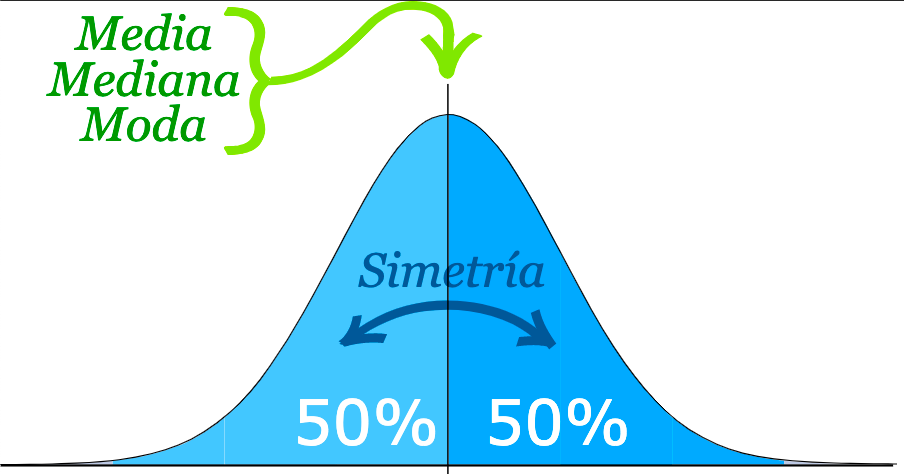

```{r setup, include=FALSE}
knitr::opts_chunk$set(echo = FALSE)
library(MASS)
library(psych)
library("knitr")
library(Rlab)
```

## **PLAN DE LA CLASE**

**1.- Introducción**

- Clasificación de variables aleatorias.
- Observar una variable cuantitativa continua.
- Predecir una variable cuantitativa continua.

**2.- Práctica con R y Rstudio cloud**

- Simular, observar y predicer una variable aleatoria continua con **R**.

- Elabora un reporte dinámico en formato pdf con **Rmarkdown**.

## **TIPOS DE VARIABLES ALEATORIAS**

```{r, echo=FALSE, out.width = '80%', fig.align='center'}
knitr::include_graphics("TiposVariables.jpg")
```

## **CASOS ESPECIALES**

**1.- Variable aleatoria binaria:** Posee dos resultados posibles; por ejemplo, éxito o fracaso, macho o hembra, sano o enfermo, (0,1).

**2.- Variable aleatoria dependiente del tiempo:** 

**a) Discreta:** Días a la muerte de un organismo o fallo de un componente en un sistema en un tiempo *t*.  
  
**b) Continua:** Señales de sensores ambientales o señales biométricas.
  
Algunas de estas variables se conocen como **series de tiempo** y en términos estrictos son más bien una *sucesión de variables aleatorias* a través del tiempo.


## **VAR. ALEATORIA CUANTITATIVA CONTINUA**

**Definición:** Puede tomar cualquier valor dentro de un intervalo (a,b), (a,Inf), (-Inf,b),(-Inf,Inf) y la probabilidad que toma cualquier punto es 0, debido a que existe un número infinito de posibilidades.

```{r, echo=FALSE, out.width = '70%', fig.align='center'}
knitr::include_graphics("FxNormal.jpg")
```

## **OBSERVAR UNA VAR. CUANTITATIVA CONTINUA**

Podemos observar en un histograma **hist()** que cuando aumenta el **n** muestral se perfila una distribución llamada **normal**.    

```{r, echo=FALSE, out.width = '70%', fig.align='center'}
par(mfrow=c(1,2))
set.seed(123)
q<-rnorm(50, 0, 1)
hist(q, col="red", main = "Histograma n= 50", xlab = "Variable cuantitativa continua q0")
q1<-rnorm(10000, 0, 1)
hist(q1, col="red", main = "Histograma n= 10000", xlab = "Variable cuantitativa continua q1")
```

## **ESTADISTICOS DE UNA MUESTRA NORMAL**

Los estadísticos más comunes son la media **mean()**, mediana **median()** y la moda **modeest::mlv()**.

```{r, echo=FALSE, out.width = '70%', fig.align='center'}

```

Imagen con Copyright©2020 [DisfrutaLasMatematicas.com](https://www.disfrutalasmatematicas.com/datos/distribucion-normal-estandar.html)

## **ESTADISTICOS DE UNA MUESTRA NORMAL CON R**

```{r, echo=TRUE}
mean(q1)
median(q1)
modeest::mlv(q1, method = "meanshift")
```

## **ESTADISTICOS DE DISPERSION Y POSICIÓN**

Entre los estadisticos de dispersión destacan la desviación estándar **sd()**, el rango **range()** y la varianza **var()**.  

Los cuantiles y sus derivados (cuartiles, quintiles, deciles, percentiles) son puntos tomados a intervalos regulares de una función de distribución de una variable aleatoria.

```{r, echo=TRUE, message=FALSE, warning=FALSE}
sd(q1)
range(q1)
quantile(q1, probs=c(0.05, 0.5, 0.8))
```


## **OBSERVAR UNA VARIABLE CON BOXPLOT**

Las gráficas de cajas y bigotes **boxplot()** son muy adecuadas para observar variables aleatorias cuantitativas continuas.

[^1]: **IQR =** **_Rango intercuantílico_** es la diferencia entre el tercer cuartil (75%) y el primer cuartil (25%) de una distribución.

```{r, echo=FALSE, out.width = '60%', fig.align='center'}

knitr::include_graphics("Boxplot.png")
```

## **PREDECIR UNA VAR. CUANTITATIVA CONTINUA**

La función de densidad empírica **density()** permite predecir la probabilidad de que la variable aleatoria tome un determinado valor. Ej. Probabilidad de que tome -2 = **dnorm(-2, 0, 1)** = 0.054

```{r , echo=FALSE, out.width = '70%', fig.align='center'}

q2<-rnorm(100000, 0, 1)
plot(density(q2), main = "Función de densidad empírica")
abline(h = NULL, v = -2, col = "gray60", lty = 3)
abline(v = NULL, h = 0.054, col = "gray60", lty = 3)


```

## **PREDECIR VARIABLES CONTINUAS 2**

La función de distribución empírica acumulada **ecdf()** permite predecir la probabilidad de que la variable aleatoria tome un valor menor o igual a un determinado valor.
Ej. Probabilidad menor o igual a 1 = **Fn <- ecdf(q2)**; **Fn(1)=0.84035**.

```{r, echo=FALSE, out.width = '70%', fig.align='center'}
 
plot(ecdf(q2),
     main= "Función de distribución empírica acumulada", col="red")
abline(h = NULL, v = 1, col = "gray60", lty = 3)
abline(h = 0.84035, v = NULL, col = "gray60", lty = 3)
Fn <- ecdf(q2)
```
## **PRÁCTICA ANÁLISIS DE DATOS**

**1).** **Guía de trabajo programación con Rmarkdown disponible en drive.** Ingresa al siguiente link de la *[clase 3](https://drive.google.com/drive/folders/1HB-Hv4YtQCcYq9GbgzWH0dGqvh_oRR4s?usp=sharing)*

**2).** **La tarea se realiza en Rstudio.cloud**. Ingresa al siguiente proyecto de *[Rstudio.Cloud](https://rstudio.cloud/spaces/160160/project/2787751)* 

## **RESUMEN DE LA CLASE**

- Identificamos y clasificamos variables aleatorias.

- Observamos una variable cuantitativa continua usando histogramas y boxplot.

- Predecimos el comportamiento de una variable cuantitativa continua usando funciones de densidad y de distribución acumulada.
