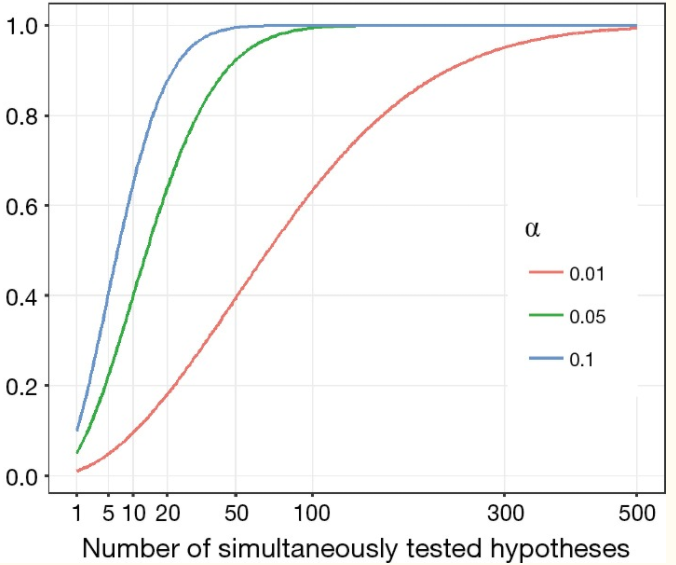

```{r setup, include=FALSE}
knitr::opts_chunk$set(echo = FALSE)
library(ggplot2)
library(UsingR)
```

## PLAN DE LA CLASE
**1.- Introducción**
    
- ¿Qué es un análisis de varianza?.   
- Modelos lineales en Anova.
- Hipótesis y supuestos.
- Interpretar resultados de análisis de varianza con R.

**2.- Práctica con R y Rstudio cloud**

- Realizar pruebas de hipótesis: Anova y posteriores.
- Realizar gráficas avanzadas con ggplot2. 
- Elaborar un reporte dinámico en formato pdf.  

## ANOVA

**¿Qué es el análisis de varianza?**

Herramienta básica para analizar el efecto de uno o más factores (cada uno con dos o más niveles) en un experimento.

```{r, echo=FALSE, out.width = '100%' }
knitr::include_graphics("anova.png")
```

## PROBLEMA DE LAS COMPARACIONES MÚLTIPLES

**¿Por qué preferir anova y no múltiples t-test?**  
Porque con una t-test normal se incrementa la tasa de error al aumentar el número de comparaciones múltiples.

```{r, echo=FALSE, out.width = '60%',fig.align='center'}

```

Fuente[1]: [1]:doi:10.21037/jtd.2017.05.34 

## ANOVA: MODELOS, HIPÓTESIS Y SUPUESTOS

**Modelos lineales**  
Respuesta ~ $\mu$ + $\alpha$ + $\epsilon$   
Respuesta ~ $\mu$ + $\alpha$ + $\beta$ + $\epsilon$    
Respuesta ~ $\mu$ + $\alpha$ + $\beta$ + $\alpha$*$\beta$ + $\epsilon$

**Hipótesis factor 1**  
**H~0~** : $\alpha_{1.1}$ = $\alpha_{1.2}$ = $\alpha_{1.3}$    

**Hipótesis factor 2**  
**H~0~** : $\beta_{2.1}$ = $\beta_{2.2}$ = $\beta_{2.3}$  

**Hipótesis interacción**  
**H~0~** : $\alpha$*$\beta$ = 0

**Supuestos:**  
	1) Independencia de las observaciones.  
	2) Normalidad.  
	3) Homocedasticidad: homogeneidad de las varianzas.  

## ANOVA PARA COMPARAR MEDIAS

**¿Por qué se llama ANOVA si se comparan medias?**  
Por que el estadístico **F** es un cociente de varianzas.     

**F** = $\frac{\sigma^2_{entre grupos}}{\sigma^2_{dentro grupos}}$  

Mientras mayor es el estadístico **F**, más es la diferencia de medias entre grupos.  

```{r, echo=FALSE, out.width = '100%' }
knitr::include_graphics("varianza-f.png")
```

## TEST POSTERIORES (PRUEBAS A POSTERIORI)

**¿Para qué sirven?**

Para identificar que pares de niveles de uno o más factores son significativamente distintos entre sí. 

**¿Cuando usarlos?**

Sólo cuando se rechaza **H~0~** del ANOVA. 

**Tukey test**  
Es uno de los más usados, similar al *t-test*, pero corrige la tasa de error por el número de comparaciones.

## R Documentation anova {stats}

**Anova de una vía**  
res.aov <- aov(respuesta ~ group, data = my_data, ...)  
summary(res.aov)  

**_aov()_**,*sólo para diseños balanceados*

```{r}
my_data <- PlantGrowth
# Compute the analysis of variance
res.aov <- aov(weight ~ group, data = my_data)
# Summary of the analysis
summary(res.aov)
```


## R Documentation TukeyHSD {stats}

TukeyHSD(res.aov)

```{r , echo=FALSE, out.width = '70%' }
tk <- TukeyHSD(res.aov)
tk
```

## R Documentation anova {stats} 2

**Anova de dos vías con interacción**    
aov1 <- aov(respuesta ~ group1 * group2)  
aov2 <- aov(respuesta ~ group1 + group2 + group1 * group2)  
aov1 = aov2  
summary(aov1)  
```{r}
my_data1 <- ToothGrowth
res.aov2 <- aov(len ~ supp * dose, data = my_data1)
summary(res.aov2)
```

## PRÁCTICA ANÁLISIS DE DATOS
- Guía de trabajo práctico disponible en drive y Rstudio.cloud.  
**Clase_09**

- El trabajo práctico se realiza en Rstudio.cloud.  
**Guía 9 Anova y posteriores**

## RESUMEN DE LA CLASE

- **Elaborar hipótesis**

- **Realizar análisis de varianza**
    * 1 factor.  
    * 1 factor con posteriores.
    * 2 factores con interacción.
    
- **Realizar gráficas avanzadas con ggplot2**    