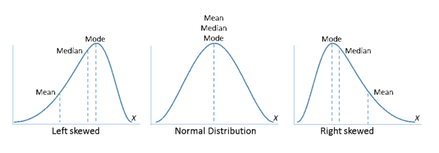

```{r setup, include=FALSE}
knitr::opts_chunk$set(echo = FALSE)
library(car)
library(lmtest)
library(dplyr)
```

# PLAN DE LA CLASE
**1.- Introducción**
    
- Supuestos de los análisis paramétricos.   
- Consecuencias de la violación de los supuestos.
- Métodos gráficos y análisis de residuos para evaluar supuestos.
- Pruebas de hipótesis para evaluar supuestos.

**2.- Práctica con R y Rstudio cloud**

- Evaluar supuestos de las pruebas paramétricas.
- Elaborar un reporte dinámico en formato pdf.  

# SUPUESTO 1: INDEPENDENCIA

**Independencia**  
Cada observación de la muestra no debe estar relacionada con otra observación de la misma muestra.  

*Si se viola este supuesto la prueba paramétrica* **_NO_** *es válida.*

**Ejemplo violación del supuesto**  
- Muestreo de animales de una misma familia.   
- Diversidad de especies en una misma muestra de plancton.  
- Medidas repetidas en un mismo individuo (antes y después de un tratamiento).  

# SUPUESTO 2: HOMOGENEIDAD DE VARIANZAS

**Homocedasticidad**  
En el caso de comparación de dos o más muestras éstas deben provenir de poblaciones con la misma varianza.
```{r, echo=FALSE, out.width = '100%' }
knitr::include_graphics("anova.png")
```

*Alguna heterogeneidad es permitida, particularmente con* **_n > 30_**.

# SUPUESTO 3: NORMALIDAD

**Normalidad**  
Los datos de muestreo se obtienen de una población que tiene distribución normal.   
**Ejemplos de violación del supuesto**   
- La distribución no es simétrica.  
- La variable no es de tipo continua.  
- Tiene _límites_ a la izquierda o derecha como los porcentajes.

```{r, echo=FALSE, out.width = '60%', fig.align='center'}
curve(dnorm,-4,4, ylab = "density")
#rnorm
par(xpd=T)
points(rnorm(100),jitter(rep(0,100)),pch=16,cex=.6,col='seagreen')
par(xpd=F)
mtext(side=3,line=.3,'X ~ Normal(0,1)',cex=.9,font=2)
```

# VIOLACIÓN DEL SUPUESTO DE NORMALIDAD

**¿Cuál es el problema?**  
Cambia la probabilidad de rechazar la hipótesis nula.

```{r, echo=FALSE, out.width = '110%' }

```

# VIOLACIÓN DEL SUPUESTO DE NORMALIDAD 2

**¿Cómo afecta que la población no tenga distribución normal a la probabilidad de rechazar?**

|  **n** | Cola izq.| Cola der.| $\alpha_{Empírica}$  |
|:-------------|:------------------|:------------------|:------------------|
| **5** | 0,20 | 0,26 | 0,46 |
| **10** | 0,24 | 0,28 | 0,52 |
| **20** | 0,23 | 0,26 | 0,49 |
| **30** | 0,24 | 0,27 | 0,51 |
| **50** | 0,24 | 0,26 | 0,50 |
| **100** | 0,24 | 0,26 | 0,50 |

*En la práctica apróximadamente normal es suficiente, particularmente con* **_n > 30_**.

# ANÁLISIS DE RESIDUALES

**¿Qué son los residuos?**  
Residuo = valor observado - valor predicho  
e = y - $\hat{y}$ 

**Residuos en ANOVA**
$$\sum_{i=1}^{n} (y - \hat{y})^2$$
*Note que la suma de residuos representa la variabilidad no explicada por el modelo.*

**¿Para qué sirven?**  
Para someter a prueba los supuestos de muchos análisis paramétricos como **ANOVA**, **ANCOVA** o **REGRESIÓN**. 

# EVALUACIÓN DE SUPUESTOS

**Regla de oro**  
Primero evalúe independencia, luego homogeneidad de varianzas y finalmente normalidad.  

**Estudio de caso**  
```{r fig.height=6 }
my_data <- ToothGrowth
names(my_data) <- c("Peso", "Tratamiento")
my_data$Tratamiento <- factor(my_data$Tratamiento, 
                             labels = c("Dieta 1", "Control"))
boxplot(Peso ~ Tratamiento, data = my_data)
```

# ANOVA

```{r, echo=TRUE}
lm.aov <- lm(Peso ~ Tratamiento, data = my_data)
anova(lm.aov)
```

# INDEPENDENCIA: ANÁLISIS DE RESIDUALES

```{r, echo=TRUE, out.width = '90%'}
plot(lm.aov$residuals, pch=20, col = "blue",
     cex.lab=1.25, cex.axis=1.25)
```

# INDEPENDENCIA: PRUEBA DE DURBIN-WATSON

**Hipótesis**  
**H~0~**: Son independientes o no existe autocorrelación.   
**H~A~**: No son independientes y existe autocorrelación.  

```{r, echo=TRUE}
dwtest(Peso ~ Tratamiento, data = my_data,
       alternative = c("two.sided"), 
       iterations = 15) # library(lmtest)

```

# HOMOGENEIDAD DE VARIANZAS: ANÁLISIS DE RESIDUALES
```{r, echo=TRUE, out.width = '85%', fig.align='center'}
plot(lm.aov, 1, pch=20, col = "blue",
     cex.lab=1.5, cex.axis=1.5, sub = "")
```

# HOMOGENEIDAD DE VARIANZAS: PRUEBA DE LEVENE

**H~0~**:  $\sigma^2_1$ = $\sigma^2_2$  
**H~A~**: $\sigma^2_1$ $\neq$ $\sigma^2_2$  

```{r, echo=TRUE}
leveneTest(Peso ~ Tratamiento, data = my_data,
           center = "median") # library(car)  
```


# NORMALIDAD: GRÁFICO DE CUANTILES

```{r, echo=TRUE}
plot(lm.aov, 2, pch=20, col = "blue")
```

# NORMALIDAD: GRÁFICO DE CUANTILES 2

```{r, echo=TRUE}
qqPlot(my_data$Peso) # library(car)
```

# NORMALIDAD: PRUEBA DE SHAPIRO-WILKS

**H~0~**: La distribución es normal.     
**H~A~**: La distribución no es normal.    

```{r, echo=TRUE}
aov_residuals <- residuals(object = lm.aov)
shapiro.test(x= aov_residuals)
```

# PRÁCTICA ANÁLISIS DE DATOS
- Guía de trabajo práctico disponible en drive y Rstudio.cloud.  
**Clasev10**

- El trabajo práctico se realiza en Rstudio.cloud.  
**Clase 10 - Evaluación de supuestos**

# RESUMEN DE LA CLASE

- **Teoría**
    * Supuestos de los análisis paramétricos.   
    * Consecuencias de la violación de los supuestos.
    * Interpretación de métodos gráficos, análisis de residuos y pruebas de hipótesis para evaluar supuestos.

- **Evaluación de supuestos**
    * Independencia.  
    * Homocedasticidad.
    * Normalidad.
    