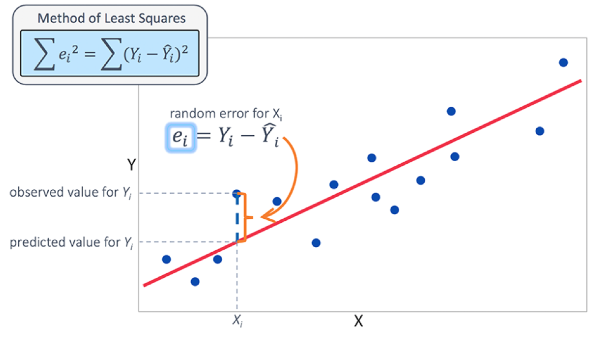

```{r setup, include=FALSE}
knitr::opts_chunk$set(echo = FALSE)
library(readxl)
library(dplyr)
library(ggplot2)
library(UsingR)
library(ggpmisc)
```

# PLAN DE LA CLASE
**1.- Introducción**
    
- Regresión lineal ¿Qué es y para qué sirve?
- Correlación v/s causalidad.
- Repaso ecuación de regresión lineal.
- Repaso Betas y causalidad.
- Interpretación Regresión lineal con R.

**2.- Práctica con R y Rstudio cloud**

- Realizar análisis de regresión lineal.
- Realizar gráficas avanzadas con ggplot2. 
- Elaborar un reporte dinámico en formato pdf.  

# REGRESIÓN LINEAL

**¿Qué es la regresión lineal y para que sirve?**

Herramienta estadística que permite determinar si existe una relación (asociación) entre una variable predictora (independiente) y la variable respuesta (dependiente).

```{r, echo=FALSE, out.width = '100%', message=FALSE}
Sea_level <- read_excel("Sea_level.xlsx")
formula1 <- y ~ x

sea_level_dat <- Sea_level %>% filter(Year > 1992) 

sea_level_dat 
# q <- sea_level_dat %>% ggplot(aes(x = Year, y = `NOAA - Adjusted sea level (cm)`)) + 
#   geom_point() +
#   stat_smooth(method = "lm", col = "red", show.legend=TRUE)+  stat_poly_eq(aes(label = paste0("atop(", ..eq.label.., ",", ..rr.label.., ")")), formula = formula1, parse = TRUE) + scale_x_continuous(n.breaks = 8)
# q
```

Fuente: https://www.epa.gov/climate-indicators/climate-change-indicators-sea-level.

# REGRESIÓN LINEAL: PREDICCIÓN.

La ecuación de la regresión permite, bajo ciertos supuestos, predecir el valor de una variable respuesta “y” a partir de una o más variable predictoras “x”.

```{r, echo=FALSE, out.width = '60%',fig.align='center'}
knitr::include_graphics("Prediccion.jpg")
```


# REGRESIÓN LINEAL: BETAS

Betas miden la influencia sobre la variable 


# LINEA DE REGRESIÓN.

Línea de regresión: Corresponde a los valores “ajustados” o estimados
de “y” en función de “x” y de los estimadores de mínimos cuadrados de 


```{r}
q
```

# RESIDUOS Y MÉTODOS DE MÍNIMOS CUADRADOS

```{r, echo=FALSE, out.width = '100%' }

```

# COCIENTE DE DETERMINACIÓN


donde: 


# CORRELACIÓN NO IMPLICA CAUSALIDAD

¿El consumo de helados incrementa el nivel del mar?  
¿Si dejamos de tomar helados disminuirá el nivel del mar?  
¿Qué factor "z" puede explicar la correlación entre consumo de helados y nivel del mar?   

```{r, message=FALSE}
r <- Sea_level %>% 
  filter(Year > 1992) %>% ggplot(aes(x = `Consumo de helados Chile (Litros)`, y = `NOAA - Adjusted sea level (cm)`)) + 
  geom_point(colour="blue") +
  stat_smooth(method = "lm", col = "red", show.legend=TRUE)+  stat_poly_eq(aes(label = paste0("atop(", ..eq.label.., ",", ..rr.label.., ")")), 
               formula = formula1, 
               parse = TRUE)+scale_x_continuous(n.breaks = 8)
r
```

# PRUEBAs DE HIPÓTESIS

**_Prueba de hipótesis del coeficiente de regresión y el intercepto_**

La hipótesis nula en ambos casos es que el coeficiente del intercepto 

**_Prueba de hipótesis del modelo completo_**

La hipótesis nula es si los coeficientes son iguales a 0.


# REGRESIÓN LINEAL SIMPLE CON R

```{r, echo=TRUE, warning=FALSE, message=FALSE}

reg <- lm(`NOAA - Adjusted sea level (cm)` ~ Year, data = sea_level_dat)
summary(reg)

```

# PREDICCIÓN LINEAL PROMEDIO

Predicción del nivel del mar promedio - próximos 3 años.
```{r, , echo=TRUE}
predict.lm(reg, newdata=data.frame(Year=c(2022,2023,2024)), interval="confidence")
```

# PREDICCIÓN LINEAL FUERA DEL RANGO OBSERVADO

Predicción del nivel del mar - próximos 3 años.
```{r, echo=TRUE}
predict.lm(reg, newdata=data.frame(Year=c(5022,5023,5024)), interval="prediction")

```


# PRÁCTICA ANÁLISIS DE DATOS
- Guía de trabajo práctico disponible en drive y Rstudio.cloud.  
**Clase_12**

- El trabajo práctico se realiza en Rstudio.cloud.  
**Guía 12 Regresión lineal**

# RESUMEN DE LA CLASE

- **Elaborar hipótesis para una regresión lineal**

- **Realizar análisis de regresión lineal simple**

- **Interpretar coeficientes y realizar predicciones**
